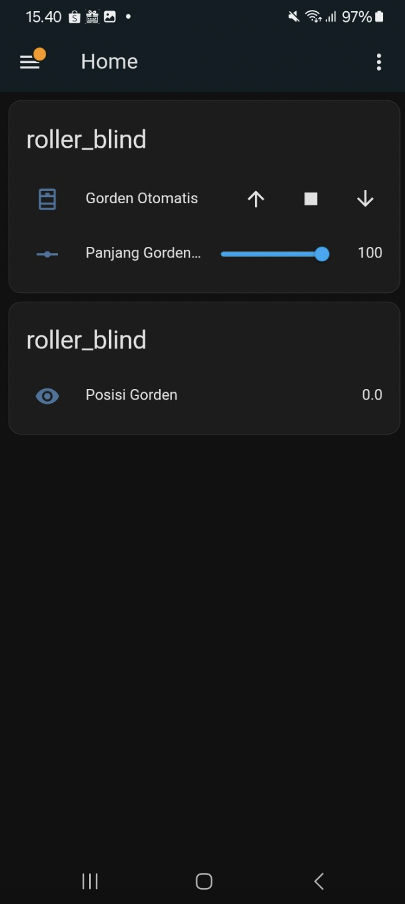

# Roller Blind ESPHome - Home Assistant

Final Project Pengembangan Sistem dan Teknologi Informasi 

Kelompok: Capstone Project **Ai**

| No. | Nama Lengkap                        | NRP         |
|-----|-------------------------------------|-------------|
| 1   | Alma Amira Dewani                   | 5027221054  |
| 2   | Khansa Adia Rahma                   | 5027221071  |


---- 

Otomatisasi rollerblind menggunakan ESP8266 (Wemos D1 Mini), driver ULN2003, dan Stepper Motor 28BYJ48 terintegrasi dengan Home Assistant melalui ESPHome.

---

## Fitur

1. Kontrol buka/tutup/berhenti melalui Home Assistant
2. Input panjang gorden (dalam cm)
3. Monitoring posisi motor gorden secara real-time
4. Tampilan dashboard Home Assistant modern

---

## 📸 Tampilan Home Assistant



---

## 🛠️ Hardware yang Digunakan

- ESP8266 Wemos D1 Mini
- Motor Stepper 28BYJ-48 + Driver ULN2003
- Power supply 5V 1A
- Wi-Fi (ESP akan terkoneksi ke jaringan)

---

## 🔧 Konfigurasi ESPHome (`roller_blind.yaml`)

```yaml
# Lihat file roller_blind.yaml di repo ini untuk konfigurasi lengkap
